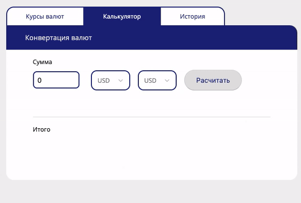

<p>

</p>
<p></p>
<p>

</p>

#### Table of Contents

- [Motivation](#motivation)
- [Functionality](#functionality)
- [Installation](#installation-and-start-localy)
- [Run Tests](#run-tests)
- [LICENCE](#licence)

#### Motivation

This is a demo SPA.
It was created to share ideas around using

- Context API as a state management
- React hooks

in authontification and state management with one source of truth

#### Functionality

- login form
- logout
- authorized components
- currency exchange list with sorting/marking as favorite
- currency exchange calculator (for existing pairs in a list)
- history tab with paggination and sorting

> [SORTED RULES]
>
> - 10 elements per page
> - not more then 2 identical deals
> - at least one deal with profit over \$100
> - not more then 2 loss deals (x < 0)
> - all deals sorted by finishDate (by descending)

[>>> LIVE DEMO HERE <<<](https://yacheckalin.github.io/simple-react-app/)

#### Installation and start localy

```javascript
yarn install
yarn start
```

#### Run tests

```javascript
yarn test
```

#### LICENCE

Copyright (c) 2020 yacheckalin

MIT
